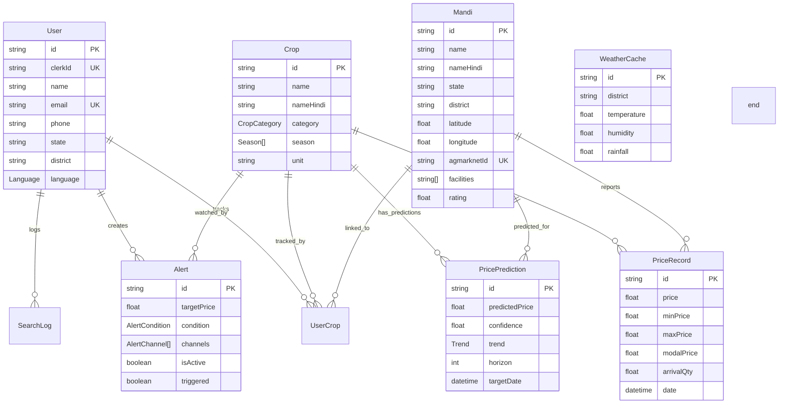

# 🌾 FasalAI — Complete Project Documentation (0 to 100)

> **FasalAI** is an AI-powered mandi (market) price intelligence platform built for Indian farmers. It tracks real-time crop prices from government sources, predicts future prices using machine learning, and sends multi-channel alerts (SMS, WhatsApp, Email) so farmers know the best time to sell.

---

## Table of Contents

1. [Vision & Problem Statement](#1-vision--problem-statement)
2. [High-Level Architecture](#2-high-level-architecture)
3. [Technology Stack](#3-technology-stack)
4. [Complete Directory Structure](#4-complete-directory-structure)
5. [Phase 1 — Database Design (Prisma Schema)](#5-phase-1--database-design-prisma-schema)
6. [Phase 2 — Next.js Application Setup](#6-phase-2--nextjs-application-setup)
7. [Phase 3 — Authentication (Clerk)](#7-phase-3--authentication-clerk)
8. [Phase 4 — Backend API Routes](#8-phase-4--backend-api-routes)
9. [Phase 5 — Frontend Dashboard UI](#9-phase-5--frontend-dashboard-ui)
10. [Phase 6 — External Integrations](#10-phase-6--external-integrations)
11. [Phase 7 — Python ML Service](#11-phase-7--python-ml-service)
12. [Phase 8 — Data Seeding Pipeline](#12-phase-8--data-seeding-pipeline)
13. [Phase 9 — Deployment](#13-phase-9--deployment)
14. [Data Flow Diagram](#14-data-flow-diagram)
15. [Environment Variables Reference](#15-environment-variables-reference)

---

## 1. Vision & Problem Statement

Indian farmers lose **15–25% of potential income** because they sell at the wrong time or at the wrong mandi. They lack access to:
- Real-time market prices across multiple mandis
- Future price trend predictions
- Timely alerts when prices hit a favorable level

**FasalAI solves this** by providing:
- ✅ Live mandi prices via the Agmarknet Government API
- ✅ AI-powered 7/15/30-day price forecasts using Scikit-Learn (RandomForest)
- ✅ Multi-channel price alerts (SMS, WhatsApp, Email)
- ✅ Bilingual interface (English + Hindi)
- ✅ Nearest mandi finder with Google Maps directions

---

## 2. High-Level Architecture

```mermaid
graph TB
    subgraph "User Layer"
        A["🧑‍🌾 Farmer (Browser)"]
    end

    subgraph "Frontend — Next.js 15 (Vercel)"
        B["Landing Page /"]
        C["Dashboard /dashboard"]
        D["API Routes /api/*"]
        E["Clerk Middleware"]
    end

    subgraph "Backend — Python FastAPI (Railway)"
        F["POST /predict"]
        G["POST /train"]
        H["GET /health"]
        I["ForecastService (RandomForest)"]
        J["ModelStore (In-Memory Cache)"]
    end

    subgraph "Database"
        K["PostgreSQL (Neon)"]
    end

    subgraph "External APIs"
        L["Agmarknet (Gov Prices)"]
        M["OpenWeatherMap"]
        N["Clerk (Auth)"]
        O["Twilio (SMS/WhatsApp)"]
        P["Resend (Email)"]
    end

    A --> B
    A --> C
    C --> D
    D --> K
    D --> F
    F --> I
    I --> J
    I --> K
    D --> L
    D --> M
    E --> N
    D --> O
    D --> P
end
```

The system is split into **two independently deployable services**:

| Service | Framework | Deployment | Port |
|---------|-----------|------------|------|
| Web App (Frontend + API) | Next.js 15 | Vercel | 3000 |
| ML Service (Predictions) | FastAPI (Python) | Railway | 8000 |

Both services share the **same PostgreSQL database** hosted on Neon.

---

## 3. Technology Stack

### Frontend & Main Backend (`fasalai-nextjs/`)

| Category | Technology | Purpose |
|----------|-----------|---------|
| Framework | **Next.js 15.5.7** (App Router) | Full-stack React framework |
| Language | **TypeScript 5** | Type-safe development |
| UI Library | **React 19** | Component rendering |
| Styling | **Tailwind CSS 4** + Vanilla CSS | Design system |
| Fonts | **DM Sans** (body) + **Syne** (display) | Google Fonts |
| Charts | **Recharts 2.12** | Interactive price charts |
| Animations | **Framer Motion 11** | Micro-animations |
| ORM | **Prisma 6** | Type-safe database queries |
| Auth | **Clerk 6** (`@clerk/nextjs`) | Authentication |
| Email | **Resend 4** + React Email | Transactional emails |
| SMS | **Twilio 5** | SMS & WhatsApp notifications |
| HTTP | **Axios 1.7** | External API calls |
| Validation | **Zod 3.23** | Schema validation |
| State | **TanStack React Query 5** | Server state management |
| Toasts | **Sonner 1.5** | Toast notifications |
| Dates | **date-fns 3.6** | Date utilities |
| Linter | **Biome 1.8** | Fast linting & formatting |

### ML Service (`fasalai-ml/`)

| Category | Technology | Purpose |
|----------|-----------|---------|
| Framework | **FastAPI** | Async Python API |
| Server | **Uvicorn** | ASGI server |
| ML | **Scikit-Learn** (RandomForest) | Price forecasting |
| Data | **Pandas** + **NumPy** | Data manipulation |
| Serialization | **Joblib** | Model persistence |
| Database | **SQLAlchemy** + **psycopg2** | PostgreSQL access |
| Validation | **Pydantic** + **pydantic-settings** | Request/response schemas |
| Auth | **python-jose** | JWT/Bearer token verification |
| Container | **Docker** (python:3.11-slim) | Production deployment |

---

## 4. Complete Directory Structure

```
FasalAI-Project/
├── .gitignore
├── FasalAI-Setup-Guide.md            # 418-line setup guide
│
├── fasalai-nextjs/                    # ── NEXT.JS APPLICATION ──
│   ├── package.json                   # Dependencies & scripts
│   ├── tsconfig.json                  # TypeScript config
│   ├── next-env.d.ts                  # Next.js type declarations
│   ├── .env.local                     # Secrets (gitignored)
│   ├── .env.example                   # Template for .env.local
│   │
│   ├── prisma/
│   │   ├── schema.prisma              # Database schema (8 models)
│   │   ├── migrations/                # SQL migration history
│   │   ├── seed.ts                    # Seeds 16 crops + 5 mandis
│   │   └── seed-prices.ts            # Seeds 15 months of mock prices
│   │
│   ├── public/
│   │   └── crops/                     # Crop images (wheat.png, etc.)
│   │
│   └── src/
│       ├── middleware.ts              # Clerk auth middleware
│       │
│       ├── app/
│       │   ├── layout.tsx             # Root layout (ClerkProvider + fonts)
│       │   ├── page.tsx               # Landing → redirects to /dashboard
│       │   ├── globals.css            # Design system (colors, glass, cards)
│       │   ├── sign-in/               # Clerk sign-in page
│       │   ├── sign-up/               # Clerk sign-up page
│       │   ├── dashboard/
│       │   │   └── page.tsx           # Server component — fetches user data
│       │   └── api/
│       │       ├── users/sync/route.ts    # User sync from Clerk
│       │       ├── crops/
│       │       │   ├── route.ts           # GET all crops
│       │       │   └── my/route.ts        # POST/DELETE user's tracked crops
│       │       ├── mandis/route.ts        # GET all mandis
│       │       ├── prices/route.ts        # GET price history
│       │       ├── predictions/route.ts   # GET cached predictions
│       │       └── alerts/route.ts        # POST/DELETE price alerts
│       │
│       ├── components/
│       │   └── dashboard/
│       │       ├── DashboardClient.tsx     # Main client layout (tabs)
│       │       ├── Sidebar.tsx            # Navigation sidebar
│       │       └── tabs/
│       │           ├── OverviewTab.tsx     # Stats + chart + price table
│       │           ├── MyCropsTab.tsx      # Crop cards + add/remove
│       │           ├── MandiFinderTab.tsx  # Mandi search + directions
│       │           ├── AIForecastTab.tsx   # Live ML predictions + chart
│       │           └── AlertsTab.tsx      # Alert CRUD + channels
│       │
│       ├── lib/
│       │   ├── prisma.ts              # Singleton Prisma client
│       │   ├── agmarknet.ts           # Agmarknet API + alert checker
│       │   ├── resend.ts              # Email templates (3 types)
│       │   └── twilio.ts             # SMS + WhatsApp notifications
│       │
│       └── types/
│           └── index.ts               # Shared TypeScript interfaces
│
└── fasalai-ml/                        # ── PYTHON ML SERVICE ──
    ├── Dockerfile                     # Docker build for Railway
    ├── railway.toml                   # Railway deployment config
    ├── requirements.txt               # Python dependencies
    ├── .env                           # ML service secrets
    ├── .env.example                   # Template
    ├── saved_models/                  # Trained .joblib model files
    │
    ├── app/
    │   ├── main.py                    # FastAPI entry point
    │   ├── config.py                  # Pydantic settings
    │   │
    │   ├── models/
    │   │   └── schemas.py             # Pydantic request/response schemas
    │   │
    │   ├── routers/
    │   │   ├── health.py              # GET /health, GET /ping
    │   │   ├── predict.py             # POST /predict, POST /predict/batch
    │   │   └── train.py               # POST /train, GET /train/status
    │   │
    │   └── services/
    │       ├── auth.py                # Bearer token verification
    │       ├── database.py            # SQLAlchemy queries for price data
    │       ├── forecast_service.py    # RandomForest training + prediction
    │       └── model_store.py         # In-memory model cache
    │
    └── scripts/
        ├── seed_prices.py             # Python mock price seeder
        └── pretrain.py                # Batch model pre-training script
```

---

## 5. Phase 1 — Database Design (Prisma Schema)

The database was designed first as the foundation. File: [schema.prisma](file:///d:/02%20fasal/FasalAI-Project/fasalai-nextjs/prisma/schema.prisma)

### 8 Database Models



### Key Enums

| Enum | Values |
|------|--------|
| `Language` | `ENGLISH`, `HINDI` |
| `CropCategory` | `GRAIN`, `OILSEED`, `VEGETABLE`, `FRUIT`, `FIBER`, `SPICE`, `PULSE`, `OTHER` |
| `Season` | `KHARIF`, `RABI`, `ZAID` |
| `Trend` | `RISING`, `FALLING`, `STABLE` |
| `AlertCondition` | `ABOVE`, `BELOW` |
| `AlertChannel` | `SMS`, `WHATSAPP`, `EMAIL` |

### Key Indexes & Constraints

- `PriceRecord`: Unique on `(cropId, mandiId, date)` — prevents duplicate daily records
- `PricePrediction`: Unique on `(cropId, mandiId, targetDate, horizon)` — one prediction per horizon per day
- `UserCrop`: Unique on `(userId, cropId)` — a user can't track the same crop twice
- `Mandi`: Geolocation indexed on `(latitude, longitude)` for proximity queries

---

## 6. Phase 2 — Next.js Application Setup

### Project Initialization

The Next.js app was created using `create-next-app` with these choices:
- **App Router** (not Pages Router)
- **TypeScript** enabled
- **Tailwind CSS 4** for styling
- **src/ directory** for source code organization

### Root Layout — [layout.tsx](file:///d:/02%20fasal/FasalAI-Project/fasalai-nextjs/src/app/layout.tsx)

The root layout wraps the entire app with:
1. **`ClerkProvider`** — provides authentication context to all pages
2. **Google Fonts** — `DM Sans` (body text) and `Syne` (headings/display)
3. **SEO Metadata** — title, description, keywords, OpenGraph tags
4. **Language** — Set to `hi` (Hindi) as the primary `lang` attribute

### Design System — [globals.css](file:///d:/02%20fasal/FasalAI-Project/fasalai-nextjs/src/app/globals.css)

A custom design system was built with:

| Token | Value | Usage |
|-------|-------|-------|
| `--color-cream` | `#fefae0` | Background |
| `--color-forest` | `#2b2e1e` | Primary text |
| `--color-green` | `#556b2f` | Primary accent (Dark Olive) |
| `--color-green-light` | `#6b8e23` | Secondary accent |
| `--color-gold` | `#f4a261` | Highlight / Alerts |
| `--color-muted` | `#666b4f` | Secondary text |

Two reusable CSS classes:
- **`.glass-panel`** — Frosted glass with `backdrop-filter: blur(20px)` — used for the sidebar and top bar
- **`.premium-card`** — White card with subtle shadow that lifts on hover with `translateY(-4px)`

The body uses a **premium mesh gradient background** with 4 radial gradients creating a warm, organic feel.

### Type System — [types/index.ts](file:///d:/02%20fasal/FasalAI-Project/fasalai-nextjs/src/types/index.ts)

13 shared TypeScript types were defined:
- `Crop`, `Mandi`, `PriceRecord`, `PricePrediction`, `Alert`, `User`
- `ApiResponse<T>`, `PricesApiResponse`, `DashboardStats`
- Enums: `Language`, `CropCategory`, `Season`, `Trend`, `AlertCondition`, `AlertChannel`

### Prisma Client — [lib/prisma.ts](file:///d:/02%20fasal/FasalAI-Project/fasalai-nextjs/src/lib/prisma.ts)

A **singleton pattern** prevents multiple Prisma instances during Next.js hot reload in development. In production, only `error` logs are enabled; in development, `query`, `error`, and `warn` logs are all enabled.

---

## 7. Phase 3 — Authentication (Clerk)

### Middleware — [middleware.ts](file:///d:/02%20fasal/FasalAI-Project/fasalai-nextjs/src/middleware.ts)

Clerk's middleware runs on every request and does two things:

1. **Route Protection** — Redirects unauthenticated users away from protected routes:
   - `/dashboard(.*)`, `/alerts(.*)`, `/profile(.*)`
   - `/api/alerts(.*)`, `/api/users(.*)`, `/api/crops/my(.*)`

2. **Automatic User Sync** — On every authenticated request, the middleware fires a non-blocking `POST /api/users/sync` request to ensure the Clerk user exists in our PostgreSQL database.

### User Sync API — [api/users/sync/route.ts](file:///d:/02%20fasal/FasalAI-Project/fasalai-nextjs/src/app/api/users/sync/route.ts)

When a user signs up or signs in:
1. Fetches the full user profile from Clerk (`currentUser()`)
2. **Upserts** into the PostgreSQL `users` table (creates if new, updates name/email/phone if existing)
3. If the user is **brand new**, sends a **Welcome Email** via Resend with onboarding instructions

---

## 8. Phase 4 — Backend API Routes

All API routes live under `src/app/api/` and use Next.js 15 Route Handlers.

### `/api/crops/my` — [route.ts](file:///d:/02%20fasal/FasalAI-Project/fasalai-nextjs/src/app/api/crops/my/route.ts)

| Method | Action | Description |
|--------|--------|-------------|
| `POST` | Add Crop | Creates a `UserCrop` record linking user → crop → mandi. Calls `revalidatePath("/dashboard")` to bust the Next.js cache. |
| `DELETE` | Remove Crop | Deletes a `UserCrop` by ID after verifying ownership. Also revalidates the dashboard. |

### `/api/alerts` — Alerts CRUD

| Method | Action | Description |
|--------|--------|-------------|
| `POST` | Create Alert | Creates an `Alert` with target price, condition (ABOVE/BELOW), and notification channels (SMS/WHATSAPP/EMAIL). |
| `DELETE` | Delete Alert | Removes an alert by ID after ownership verification. |

### `/api/prices` — Price Data

Returns historical price records for a given `cropId` and `mandiId`, with optional `latest=true` flag to get only the most recent price.

### `/api/predictions` — Cached Predictions

Returns cached ML predictions from the database for a given crop-mandi-horizon combination.

---

## 9. Phase 5 — Frontend Dashboard UI

The dashboard is a **tab-based single-page application** with 5 views.

### Server-Side Data Fetching — [dashboard/page.tsx](file:///d:/02%20fasal/FasalAI-Project/fasalai-nextjs/src/app/dashboard/page.tsx)

This is a **React Server Component** that:
1. Authenticates the user via Clerk
2. Fetches the user with their tracked crops, mandis, and active alerts (Prisma `include`)
3. Fetches the latest 20 price records for the user's crops
4. Fetches all crops and mandis for the "Add Crop" modal
5. Passes everything as props to the client-side `DashboardClient`

### Client Layout — [DashboardClient.tsx](file:///d:/02%20fasal/FasalAI-Project/fasalai-nextjs/src/components/dashboard/DashboardClient.tsx)

Manages:
- **Active tab state** (`overview | my-crops | mandis | ai-forecast | alerts`)
- **Language toggle** (English ↔ Hindi)
- **Sidebar open/close** (responsive mobile menu)
- **Top bar** with greeting, language switcher, notification bell, Clerk `UserButton`

### Sidebar — [Sidebar.tsx](file:///d:/02%20fasal/FasalAI-Project/fasalai-nextjs/src/components/dashboard/Sidebar.tsx)

5 navigation items with icons and bilingual labels:
- 📊 Dashboard, 🌾 My Crops, 🏪 Mandi Finder, 🤖 AI Forecast, 🔔 Alerts

Uses the frosted glass aesthetic with the FasalAI logo at the top.

---

### Tab 1: Overview — [OverviewTab.tsx](file:///d:/02%20fasal/FasalAI-Project/fasalai-nextjs/src/components/dashboard/tabs/OverviewTab.tsx)

| Section | Description |
|---------|-------------|
| **Stats Grid** | 4 cards: Crops Tracked, Active Alerts, Prices Today, AI Accuracy |
| **Price Trend Chart** | Recharts `AreaChart` showing 30-day price history with a gradient fill. Dropdown to switch between crops. |
| **Top Mandi Prices Table** | Table of 5 crops with current price, % change, and 7-day forecast |
| **Quick Actions** | Two buttons: "Add a Crop" (→ My Crops tab) and "Set Price Alert" (→ Alerts tab) |

---

### Tab 2: My Crops — [MyCropsTab.tsx](file:///d:/02%20fasal/FasalAI-Project/fasalai-nextjs/src/components/dashboard/tabs/MyCropsTab.tsx)

| Feature | Description |
|---------|-------------|
| **Crop Cards** | Displays each tracked crop as a rich card with image, field data, planting/harvest dates, progress bar |
| **3-Dot Menu** | Dropdown with "View Details" and "Remove Crop" (with confirmation dialog) |
| **Filter Toolbar** | Three views: All Crops, Fields (grouped by location), Seasons (grouped by Kharif/Rabi/Zaid) |
| **Search** | Filters crops by name (English or Hindi) |
| **Add Crop Modal** | Searchable list of all crops, optional mandi selector, calls `POST /api/crops/my` |
| **Detail Modal** | Shows soil moisture, temperature, disease risk, irrigation schedule. "Generate AI Insights" button fetches crop-specific advice. |

If the user has no crops, 4 default placeholder crops are displayed (Wheat, Soybean, Cotton, Maize).

---

### Tab 3: Mandi Finder — [MandiFinderTab.tsx](file:///d:/02%20fasal/FasalAI-Project/fasalai-nextjs/src/components/dashboard/tabs/MandiFinderTab.tsx)

| Feature | Description |
|---------|-------------|
| **Search Bar** | Filters mandis by name, Hindi name, or district |
| **"Near Me" Button** | Uses `navigator.geolocation` to get the user's GPS coordinates, then sorts mandis by proximity (coordinate distance). Button turns green with ✓ when active. |
| **Mandi Cards** | Each card shows: name (bilingual), district/state, rating (⭐), timings (🕐), facilities (badges) |
| **Get Directions** | Opens Google Maps in a new tab with `destination={lat},{lng}` pre-filled |

---

### Tab 4: AI Forecast — [AIForecastTab.tsx](file:///d:/02%20fasal/FasalAI-Project/fasalai-nextjs/src/components/dashboard/tabs/AIForecastTab.tsx)

| Feature | Description |
|---------|-------------|
| **Live Predictions** | On mount, fetches real predictions from `/api/predictions` for the user's tracked crops (or 6 default crops). Fetches 7-day, 15-day, and 30-day horizons in parallel. |
| **Crop Selector** | Pill-style buttons to switch between crops, with crop images |
| **Forecast Hero Card** | Dark olive card showing: Current Price, N-Day Prediction, AI Confidence %, trend indicator, and a contextual recommendation ("Consider waiting to sell" or "Consider selling soon") |
| **Bar Chart** | Recharts `BarChart` with Today vs 7d vs 15d vs 30d predicted prices. Current price in dark green, predictions in light green. |
| **Horizon Toggle** | Switch between 7d / 15d / 30d views |
| **All Crops Table** | Table of all crops with current, 7d, 15d, 30d prices, and confidence bars |

---

### Tab 5: Alerts — [AlertsTab.tsx](file:///d:/02%20fasal/FasalAI-Project/fasalai-nextjs/src/components/dashboard/tabs/AlertsTab.tsx)

| Feature | Description |
|---------|-------------|
| **Alert Cards** | Each alert shows: crop name, condition (ABOVE/BELOW), target price, notification channels (SMS/WhatsApp/Email badges), status (Watching ⏳ or Triggered ✅) |
| **Delete Button** | Red trash icon with loading state |
| **Create Alert Modal** | Form with: Crop dropdown, Mandi dropdown (optional), Condition selector, Target price input, Channel toggle buttons (SMS/WHATSAPP/EMAIL) |

---

## 10. Phase 6 — External Integrations

### 10.1 Agmarknet — [lib/agmarknet.ts](file:///d:/02%20fasal/FasalAI-Project/fasalai-nextjs/src/lib/agmarknet.ts)

The Government of India's **Agmarknet API** provides daily prices for agricultural commodities across all mandis.

| Function | Purpose |
|----------|---------|
| `fetchAgmarknetPrices()` | Fetches prices by commodity, state, district, market, and date range. Falls back to mock data in development. |
| `syncPricesToDB()` | Iterates over all crops × mandis, fetches latest prices, upserts into `PriceRecord` table |
| `checkAndFireAlerts()` | After syncing, checks all active alerts. If a price crosses the target threshold, marks the alert as triggered and fires notifications. |
| `fireAlertNotifications()` | Dispatches via SMS, WhatsApp, and/or Email depending on the alert's configured channels |

### 10.2 Resend (Email) — [lib/resend.ts](file:///d:/02%20fasal/FasalAI-Project/fasalai-nextjs/src/lib/resend.ts)

Three fully designed HTML email templates:

| Template | When Sent |
|----------|-----------|
| **Price Alert Email** | When a price crosses the user's target. Shows crop name (bilingual), current price in a styled box, target price, and a "View Dashboard" CTA. |
| **Welcome Email** | When a new user signs up. Shows 3-step onboarding guide. |
| **Weekly Report Email** | Weekly digest with a table of all tracked crop prices and % changes. |

All emails use the FasalAI brand colors (olive green header, cream accents) and are mobile-responsive.

### 10.3 Twilio (SMS & WhatsApp) — [lib/twilio.ts](file:///d:/02%20fasal/FasalAI-Project/fasalai-nextjs/src/lib/twilio.ts)

| Function | Purpose |
|----------|---------|
| `sendAlertSMS()` | Sends a plain SMS or WhatsApp message (auto-detects via `whatsapp:` prefix) |
| `sendPriceAlertSMS()` | Formatted price alert with crop name, current price, target, and CTA |
| `sendWhatsAppAlert()` | Rich WhatsApp message with bold formatting and Hindi text (मूल्य अलर्ट) |
| `sendWeeklySummary()` | Weekly price summary sent via WhatsApp with bullet-point crop prices |

---

## 11. Phase 7 — Python ML Service

### 11.1 Entry Point — [app/main.py](file:///d:/02%20fasal/FasalAI-Project/fasalai-ml/app/main.py)

- Creates a FastAPI app with title "FasalAI ML Service"
- **Lifespan handler**: On startup, loads all pre-trained models from disk into memory (`ModelStore`)
- **CORS middleware**: Allows requests from the Next.js frontend (`localhost:3000`)
- **3 routers**: Health, Predict, Train

### 11.2 Configuration — [app/config.py](file:///d:/02%20fasal/FasalAI-Project/fasalai-ml/app/config.py)

Uses **Pydantic Settings** to load environment variables:

| Setting | Default | Purpose |
|---------|---------|---------|
| `DATABASE_URL` | `""` | Neon PostgreSQL connection string |
| `ML_SERVICE_SECRET` | `"dev-secret"` | Bearer token for auth |
| `MODEL_DIR` | `./saved_models` | Directory for .joblib files |
| `RETRAIN_INTERVAL_HOURS` | `24` | Hours before a model is considered stale |
| `MIN_TRAINING_DAYS` | `30` | Minimum data points required for training |

### 11.3 Authentication — [app/services/auth.py](file:///d:/02%20fasal/FasalAI-Project/fasalai-ml/app/services/auth.py)

Simple **Bearer token** authentication. The Next.js app sends `ML_SERVICE_SECRET` in the `Authorization` header. The Python service verifies it matches its own env var. This ensures only the Next.js backend can call the ML service.

### 11.4 Database Service — [app/services/database.py](file:///d:/02%20fasal/FasalAI-Project/fasalai-ml/app/services/database.py)

Uses **SQLAlchemy** to connect to the same Neon PostgreSQL database:

| Method | Purpose |
|--------|---------|
| `get_price_history()` | Fetches daily prices for a crop-mandi pair, grouped by date, with aggregated modal/min/max prices and total arrivals |
| `get_latest_price()` | Gets the most recent price |
| `get_all_crop_mandi_pairs()` | Finds all unique crop-mandi combos with at least `MIN_TRAINING_DAYS` of data |
| `get_crop_info()` / `get_mandi_info()` | Lookup helpers |
| `save_prediction()` | Upserts a prediction into `price_predictions` table (ON CONFLICT UPDATE) |

### 11.5 Forecast Service — [app/services/forecast_service.py](file:///d:/02%20fasal/FasalAI-Project/fasalai-ml/app/services/forecast_service.py)

This is the **core ML engine**. It uses **Scikit-Learn's RandomForestRegressor** for time-series price forecasting.

#### Feature Engineering (`_add_features`)

1. **Fill missing dates** — Mandis don't operate on holidays; gaps are filled and prices are forward-filled
2. **Time features**: `day_of_year`, `month`, `day_of_week`, `trend_idx` (linear)
3. **Arrival quantity** — Supply volume (if available, >10 non-null values)
4. **Outlier removal** — Prices 3x above/below the 14-day rolling median are replaced with the median

#### Training (`train`)

1. Validates minimum data requirement (30 days)
2. Fits a `RandomForestRegressor(n_estimators=100, max_depth=15)` on engineered features
3. **Cross-validation** with `TimeSeriesSplit(n_splits=3)` to calculate MAPE, RMSE, MAE
4. Saves the model to disk as a `.joblib` file

#### Prediction (`predict`)

1. Creates a future DataFrame for the requested horizon (1–90 days)
2. Generates features for each future date
3. Runs `model.predict()` on the future features
4. Estimates **uncertainty bounds** (±8% standard deviation)
5. Calculates a **confidence score** (70–95% based on volatility)
6. Determines **trend** (RISING if >2% change, FALLING if <-2%, else STABLE)
7. Identifies the **best sell day** (day with highest predicted price)
8. Returns daily forecasts with upper/lower bounds

#### Mock Predictions (`generate_mock_prediction`)

When no historical data exists, generates realistic mock predictions using known price ranges for common Indian crops.

### 11.6 Model Store — [app/services/model_store.py](file:///d:/02%20fasal/FasalAI-Project/fasalai-ml/app/services/model_store.py)

An **in-memory cache** that prevents reloading models from disk on every API request:
- On startup, scans `saved_models/` for `.joblib` files and loads them all
- Models are keyed as `crop_id__mandi_id`
- Checks `needs_retraining()` — true if the model file is >24 hours old

### 11.7 Predict Router — [app/routers/predict.py](file:///d:/02%20fasal/FasalAI-Project/fasalai-ml/app/routers/predict.py)

**`POST /predict`** — The main endpoint called by the Next.js frontend:

```
Flow:
1. Check if a trained model exists in the memory cache
2. If not → fetch 2 years of historical data → train model → cache
3. Run prediction for the requested horizon (7/15/30 days)
4. Save prediction to the database for caching
5. Return: predicted_price, confidence, trend, daily_forecast, best_sell_day
```

**`POST /predict/batch`** — Predicts multiple crop-mandi pairs at once (max 20). Used for pre-populating the dashboard.

### 11.8 Train Router — [app/routers/train.py](file:///d:/02%20fasal/FasalAI-Project/fasalai-ml/app/routers/train.py)

**`POST /train`** — Triggers model training:
- If `crop_id` + `mandi_id` given → train only that pair
- If neither given → discover all pairs from DB and train all
- Training runs as a **FastAPI BackgroundTask** so the API responds immediately

**`GET /train/status`** — Returns the status of all loaded models (age, retraining status).

### 11.9 Health Router — [app/routers/health.py](file:///d:/02%20fasal/FasalAI-Project/fasalai-ml/app/routers/health.py)

- **`GET /health`** — Returns status, models loaded count, uptime. Used by Railway/Render for uptime monitoring.
- **`GET /ping`** — Simple `{ "pong": true }` for load balancer checks.

### 11.10 Pydantic Schemas — [app/models/schemas.py](file:///d:/02%20fasal/FasalAI-Project/fasalai-ml/app/models/schemas.py)

| Schema | Purpose |
|--------|---------|
| `PredictRequest` | `crop_id`, `mandi_id`, `horizon (1–90)` |
| `PredictResponse` | Full prediction with `current_price`, `predicted_price`, `confidence`, `trend`, `daily_forecast[]`, `best_sell_day` |
| `DayPrediction` | Single day: `date`, `predicted_price`, `lower_bound`, `upper_bound` |
| `TrainRequest` | Optional `crop_id`/`mandi_id` + `force_retrain` flag |
| `TrainResponse` | `status`, `models_trained`, `failed`, `training_time_seconds` |
| `HealthResponse` | `status`, `models_loaded`, `uptime_seconds`, `version` |

---

## 12. Phase 8 — Data Seeding Pipeline

### 12.1 Crop & Mandi Seed — [prisma/seed.ts](file:///d:/02%20fasal/FasalAI-Project/fasalai-nextjs/prisma/seed.ts)

Run via `npm run db:seed`. Seeds the database with:

**16 Crops** across 8 categories:

| Category | Crops |
|----------|-------|
| Grain | Wheat, Maize, Paddy |
| Oilseed | Soybean, Mustard |
| Vegetable | Onion, Tomato, Potato, Cabbage, Cauliflower, Brinjal |
| Fiber | Cotton |
| Spice | Garlic, Chilli |
| Pulse | Chana (Chickpea) |
| Other | Sugarcane |

**5 Mandis** in Madhya Pradesh:
- Indore (⭐ 4.2), Ujjain (⭐ 3.9), Dewas (⭐ 3.7), Khargone (⭐ 4.0), Bhopal (⭐ 4.5)

Each mandi has GPS coordinates, Agmarknet IDs, operating timings, and facility lists.

### 12.2 Price History Seed — [prisma/seed-prices.ts](file:///d:/02%20fasal/FasalAI-Project/fasalai-nextjs/prisma/seed-prices.ts)

Generates **~15 months of realistic daily price data** for every crop-mandi pair. The algorithm uses:

1. **Base prices** per crop (e.g., Wheat: ₹2,185, Cotton: ₹6,800)
2. **Seasonal factors** — Monthly multipliers simulating real agricultural price cycles
3. **Mandi multipliers** — Different mandis have slightly different price levels
4. **Mean-reverting random walk** — Prices naturally drift but are pulled back toward seasonal targets (5% mean reversion per day)
5. **Gaussian noise** — Adds realistic daily volatility
6. **Random gaps** — Skips ~15% of days (mandis are closed on some days)
7. **Spreads** — Generates min/max prices with a 5–13% spread around the modal price

This produces ~17,800 price records total, which is enough data for the ML models to train on.

---

## 13. Phase 9 — Deployment

### Next.js → Vercel

1. Push to GitHub
2. Connect repo to Vercel
3. **Build command**: `prisma generate && prisma migrate deploy && next build`
4. Add all `.env.local` variables in Vercel dashboard
5. Update `NEXT_PUBLIC_APP_URL` to the Vercel domain

### Python ML → Railway

1. Push `fasalai-ml/` to GitHub
2. Connect to Railway
3. Railway auto-detects the [Dockerfile](file:///d:/02%20fasal/FasalAI-Project/fasalai-ml/Dockerfile):
   - Base image: `python:3.11-slim`
   - System deps: `gcc`, `g++`, `libpq-dev` (for psycopg2)
   - Runs: `uvicorn app.main:app --host 0.0.0.0 --port 8000 --workers 2`
4. Add `.env` variables in Railway dashboard
5. Update `ML_SERVICE_URL` in Vercel to point to the Railway URL

### Security

- The ML service is protected by a **shared secret** (`ML_SERVICE_SECRET`) that must match between Next.js and Python
- Clerk middleware protects all dashboard and user-specific API routes
- Public routes (prices, crops catalog, mandis) are accessible without authentication

---

## 14. Data Flow Diagram

```
┌──────────────────────────────────────────────────────────────────────────┐
│  FARMER opens browser → goes to fasalai.in                              │
│       ↓                                                                  │
│  Clerk checks auth → if not logged in → redirect to /sign-in             │
│       ↓                                                                  │
│  Middleware fires POST /api/users/sync (non-blocking)                    │
│       ↓                                                                  │
│  /dashboard (Server Component) fetches from PostgreSQL:                  │
│    • User + crops + alerts                                               │
│    • Latest 20 prices                                                    │
│    • All crops & mandis catalogs                                         │
│       ↓                                                                  │
│  DashboardClient renders with 5 tabs                                     │
│       ↓                                                                  │
│  When user clicks "AI Forecast" tab:                                     │
│    → Frontend calls /api/predictions for each crop                       │
│    → If cached prediction exists in DB → return it                       │
│    → If not → Next.js calls Python ML service POST /predict              │
│       → ML service checks ModelStore for cached model                    │
│       → If no model → fetch 2yr price data → train RandomForest → cache │
│       → Run prediction → save to DB → return result                      │
│       ↓                                                                  │
│  When user sets a price alert:                                           │
│    → POST /api/alerts → saved to DB                                      │
│    → Background: Agmarknet sync runs periodically                        │
│    → checkAndFireAlerts() checks all active alerts                       │
│    → If triggered → sends SMS/WhatsApp/Email                             │
└──────────────────────────────────────────────────────────────────────────┘
```

---

## 15. Environment Variables Reference

### Next.js (`.env.local`)

| Variable | Required | Description |
|----------|----------|-------------|
| `DATABASE_URL` | ✅ | Neon PostgreSQL connection string |
| `NEXT_PUBLIC_CLERK_PUBLISHABLE_KEY` | ✅ | Clerk frontend key (`pk_test_...`) |
| `CLERK_SECRET_KEY` | ✅ | Clerk backend key (`sk_test_...`) |
| `RESEND_API_KEY` | ✅ | Resend email API key (`re_...`) |
| `RESEND_FROM_EMAIL` | ❌ | Sender email (default: `onboarding@resend.dev`) |
| `TWILIO_ACCOUNT_SID` | ❌ | Twilio account SID (`AC...`) |
| `TWILIO_AUTH_TOKEN` | ❌ | Twilio auth token |
| `TWILIO_PHONE_NUMBER` | ❌ | Twilio SMS number |
| `TWILIO_WHATSAPP_NUMBER` | ❌ | Twilio WhatsApp sandbox number |
| `OPENWEATHER_API_KEY` | ❌ | OpenWeatherMap API key |
| `AGMARKNET_API_KEY` | ❌ | Government data API key |
| `ML_SERVICE_URL` | ✅ | Python ML service URL (`http://localhost:8000`) |
| `ML_SERVICE_SECRET` | ✅ | Shared secret between Next.js and Python |
| `NEXT_PUBLIC_APP_URL` | ✅ | App URL (`http://localhost:3000`) |

### Python ML (`.env`)

| Variable | Required | Description |
|----------|----------|-------------|
| `DATABASE_URL` | ✅ | Same Neon PostgreSQL string |
| `ML_SERVICE_SECRET` | ✅ | Must match Next.js value |
| `PORT` | ❌ | Server port (default: 8000) |
| `ENV` | ❌ | `development` or `production` |
| `MODEL_DIR` | ❌ | Model save directory (default: `./saved_models`) |

---

> *Built with ❤️ for India's farmers — FasalAI 2026*
